le projet "AfriTalent "  réalise par Amy Sylla en licence 1 RT  est une plateform qui permet de valoriser les talents africains et de faciliter leurs compétences et trouver des opportunités.
Le projet a été développé avec des technologies comme HTML , css et JavaScript pour créer une interface simple et facile à utiliser. Il propose des fonctionnalités comme l' affichage des profils et la gestion des informations et utilisateurs .
pour le lancer , il suffit d' ouvrir le fichier principal (index.html) dans un navigateur ou d utiliser un serveur local si nécessaire . les ressources utilisées sont principalement le boostrap , les sites MDN web Docs , 

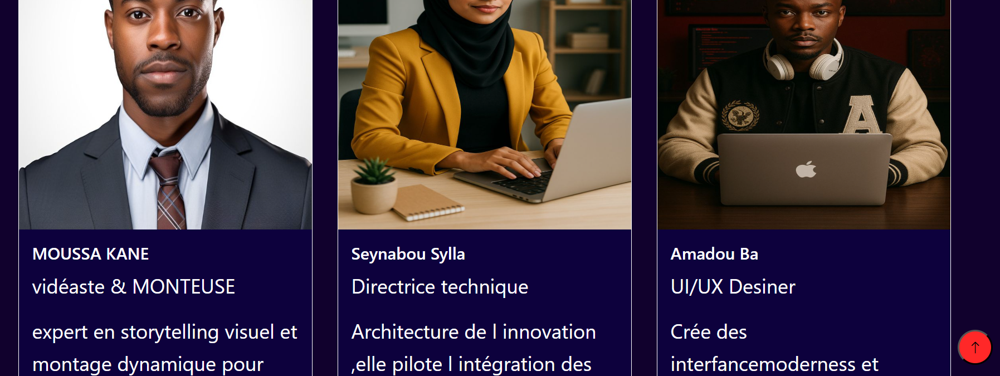](<Capture d'écran 2026-06-27 011539.png>) ](<Capture d'écran 2026-06-27 011232.png>) ](<Capture d'écran 2026-06-27 011004.png>) ](<Capture d'écran 2026-06-27 010522.png>) ](<Capture d'écran 2026-06-27 010215.png>) ](<Capture d'écran 2026-06-27 005853.png>)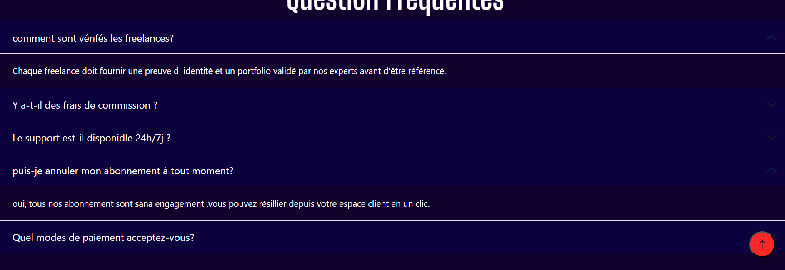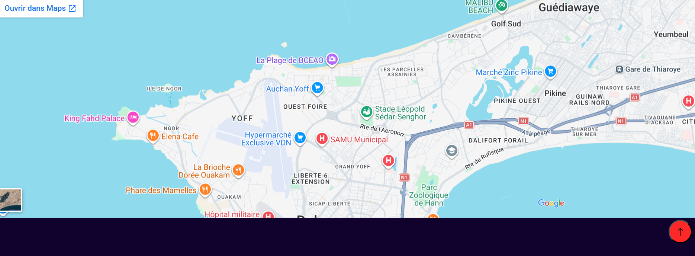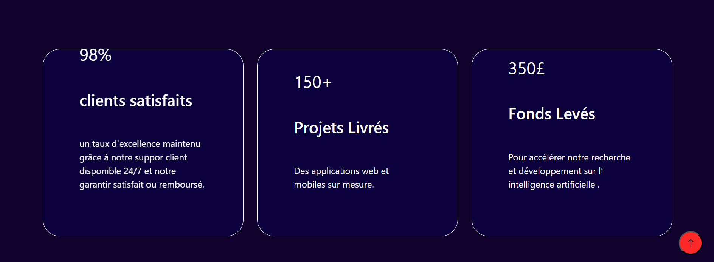cv =)^pmù:!
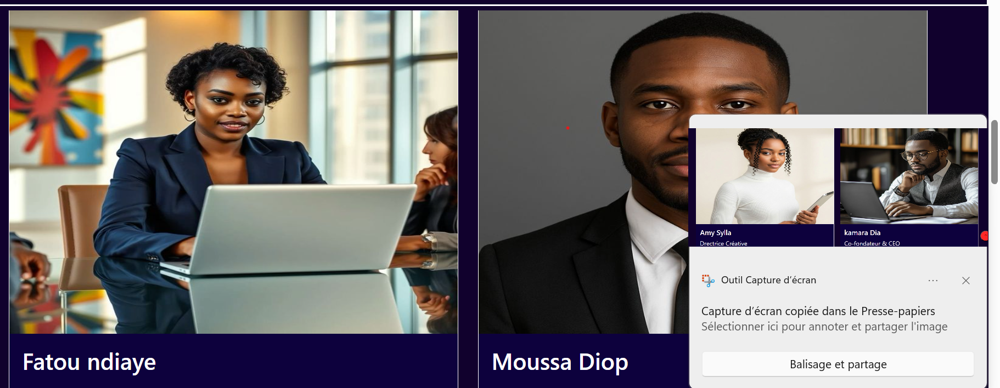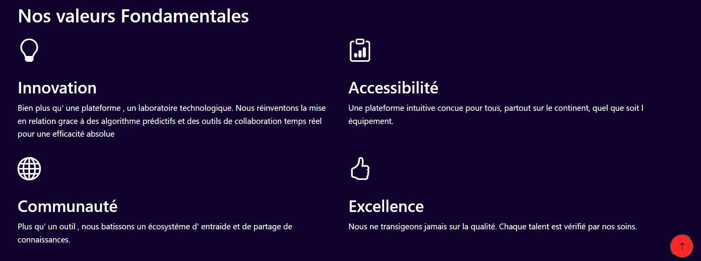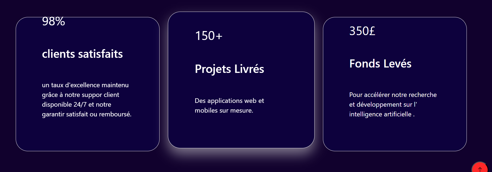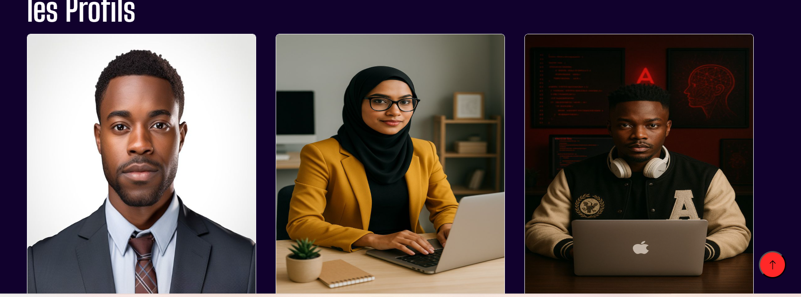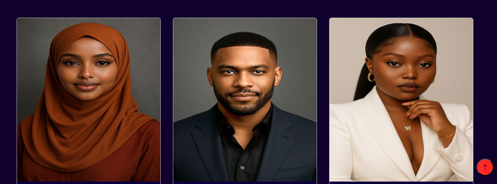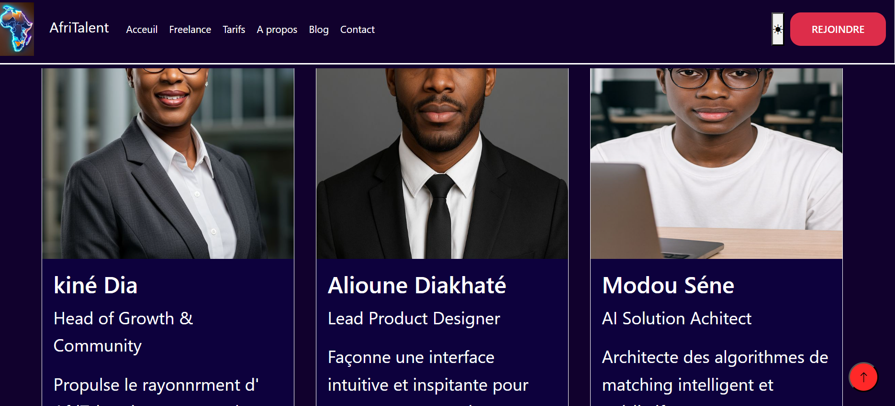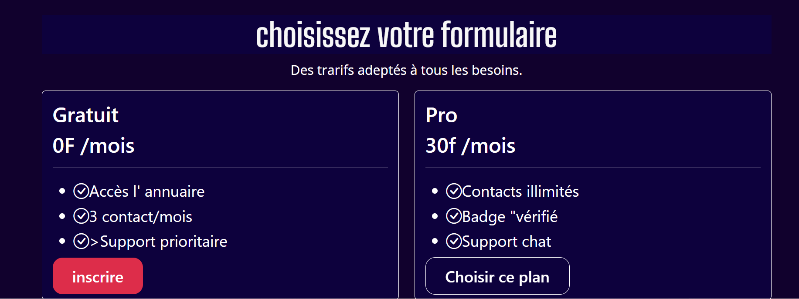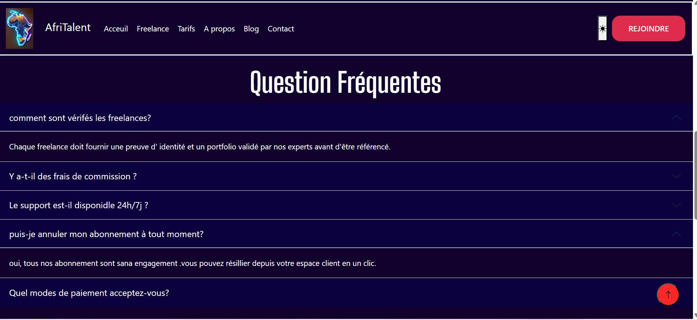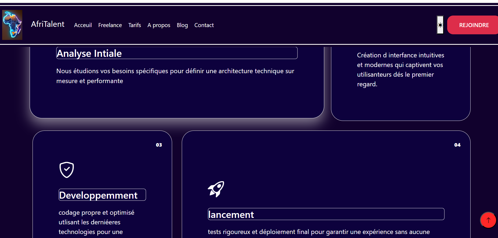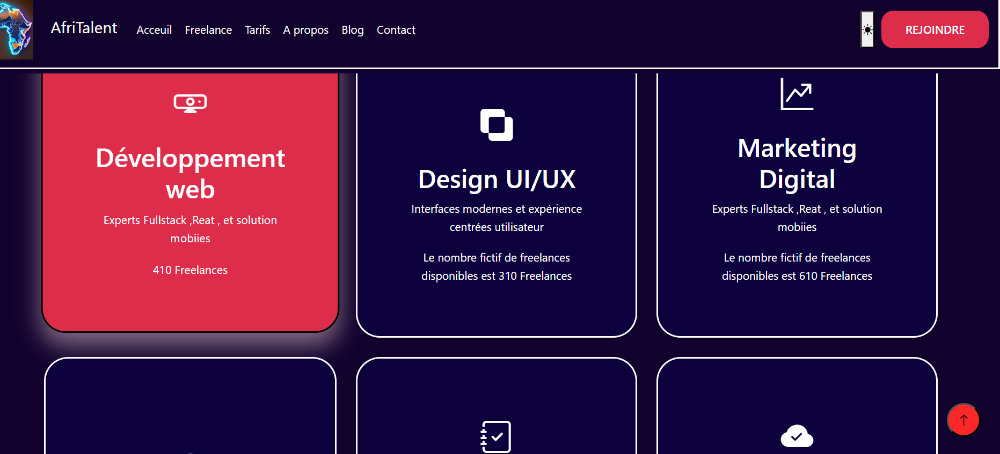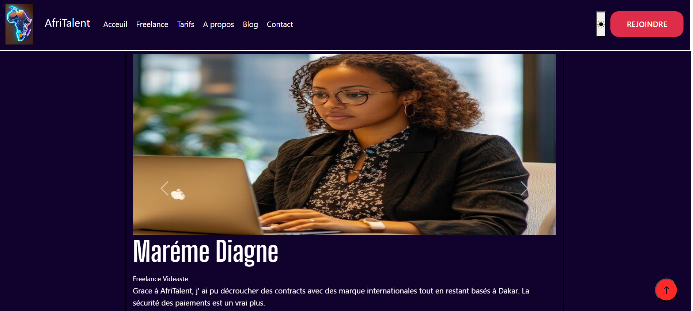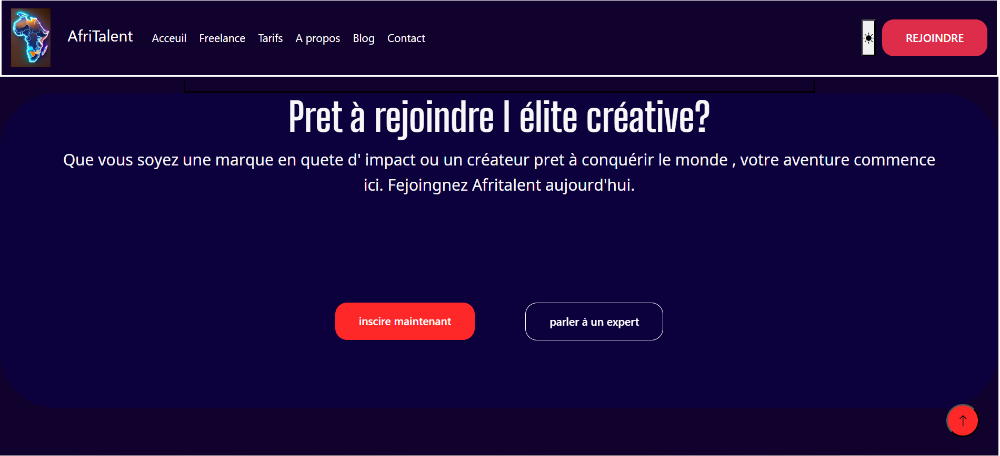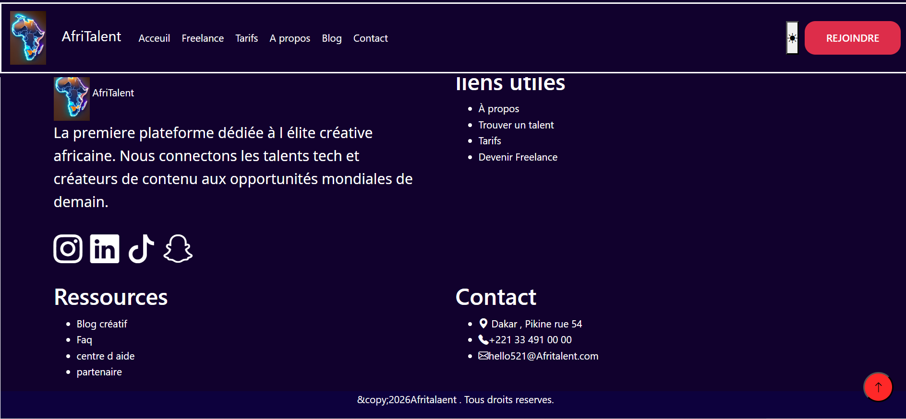